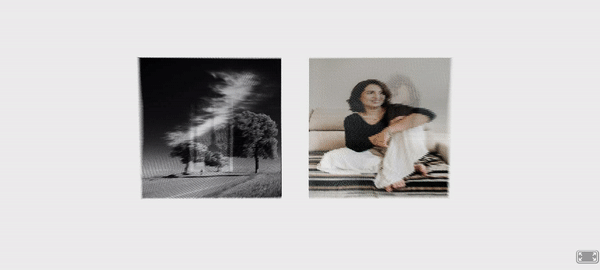

# A-Frame-Component-Lenticular-Image


### **Description / Rationale**
This is A-Frame component for creating lenticular image effects in AR and VR. The original source code was taken from <a href="https://twitter.com/ycwhk?lang=en">YCW</a>'s <a href="https://codepen.io/ycw/pen/xxVPMwB">Codepen Repository</a> and various modifications adapted to A-Frame environment.


### **Instructions**
In order to use the component attach "lenticular-image" to a-entity. The component has the following attributes: 
* <b>img1: { type: "string", default: "" }</b> - URL to first image.
* <b>img2: { type: "string", default: "" }</b> - URL to second image.

The code below shows the sample implementation of the component:
```
<html>
<head>
    <title>A-Frame Component: Lenticular Image</title>
    <script src='https://aframe.io/releases/1.4.2/aframe.min.js'></script>
    <script src="js/lenticular-image-component.js"></script>
</head>
<body>
    <a-scene>
        <a-entity lenticular-image="img1: img/image3.jpg; img2: img/image4.jpg" scale="0.5 0.5 0.5" position="0 1 -2"></a-entity>
        <a-entity lenticular-image="img1: img/image1.jpg; img2: img/image2.jpg" scale="0.5 0.5 0.5" position="2 1 -2"></a-entity>
        <a-sky color='#ECECEC'></a-sky>
    </a-scene>
</body>
</html>
```

### **Tech Stack**
The project is powered by AFrame and Three.js. The all four images used were taken from Unsplash.com: 
<a href="https://images.unsplash.com/photo-1534330207526-8e81f10ec6fc?ixlib=rb-4.0.3&q=85&fm=jpg&crop=entropy&cs=srgb=sasha-freemind-Pv5WeEyxMWU-unsplash.jpg">image 1</a>, <a href="https://images.unsplash.com/photo-1568602471122-7832951cc4c5?ixlib=rb-4.0.3&q=85&fm=jpg&crop=entropy&cs=srgb=christian-buehner-DItYlc26zVI-unsplash.jpg">image 2</a>, <a href="https://images.unsplash.com/photo-1592621385612-4d7129426394?ixlib=rb-4.0.3&q=85&fm=jpg&crop=entropy&cs=srgb=jonathan-borba-n1B6ftPB5Eg-unsplash.jpg">image 3</a>, <a href="https://images.unsplash.com/photo-1446149330071-2f5996cb1b5e?ixlib=rb-4.0.3&q=85&fm=jpg&crop=entropy&cs=srgb=alex-padurariu-qJmfb_wWXhw-unsplash.jpg">image 4</a>.
        
### **Demo**
See demo of the component here: [Demo](https://lenticular-image.glitch.me/)
